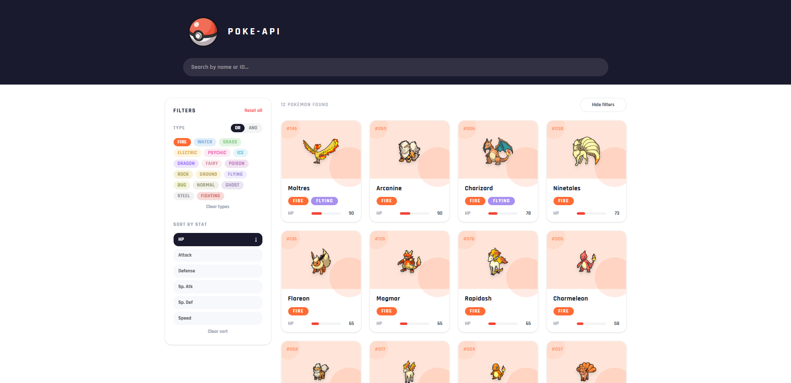
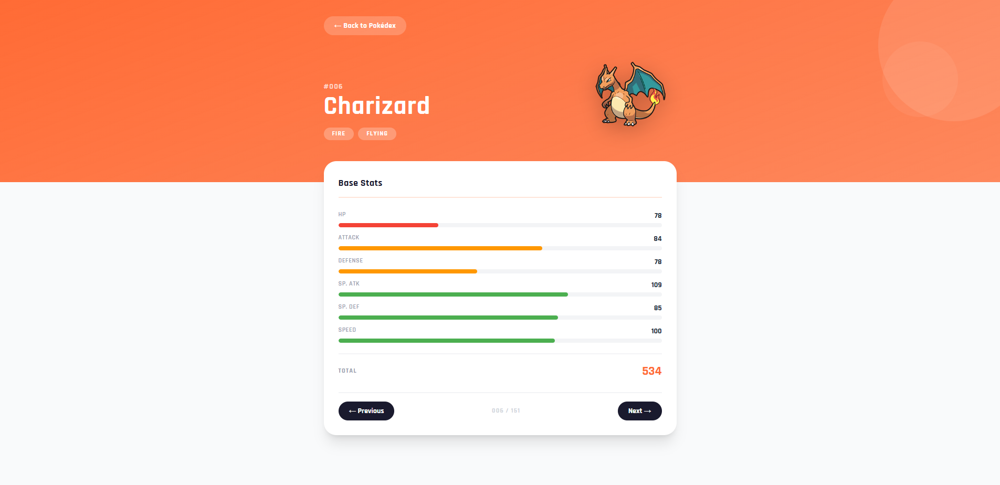
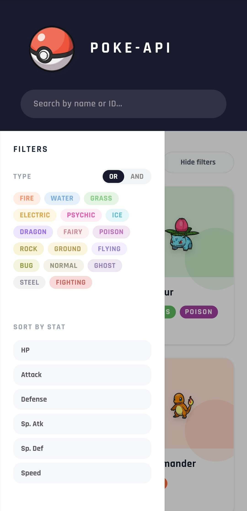

# PokeAPI
 
A full-stack Pokédex application built with Spring Boot GraphQL and React. Browse, search, filter and sort all 151 Generation 1 Pokémon with a clean, responsive UI.
 
🔗 **[Live Demo](https://poke-api-admigi.up.railway.app)**
 
---
 
## 🛠️ Tech Stack
 
**Backend**
- Java 21 / Spring Boot
- Spring for GraphQL
- Maven
- JUnit (unit tests)
  
**Frontend**
- React 19 / TypeScript
- TanStack Start (SSR) + TanStack Router
- Tailwind CSS v4
- Vite
- Vitest + React Testing Library (component tests)
  
**Infrastructure**
- Docker / Docker Compose
- GitHub Actions (CI/CD)
- Railway (deployment)
---
 
## 🏗️ Architecture
 
Monorepo with two independently deployed services on Railway.
 
```
PokeAPI/
├── backend/       # Spring Boot GraphQL API
├── frontend/      # TanStack Start SSR app
└── docker-compose.yml
```
 
**Backend** exposes a single `/graphql` endpoint with queries for listing Pokémon (with filtering, sorting and pagination), fetching a single Pokémon by ID, and retrieving global stat maximums for stat bar scaling. Data is served from a local JSON dataset.
 
**Frontend** is a server-side rendered React app. GraphQL is fetched directly with the native `fetch` API — no Apollo or urql. All UI state (search, filters, sort, page) lives in the URL, making every view shareable and bookmarkable.
 
---
 
## ✨ Features
 
### Grid Page
- Responsive card grid — 2 columns on mobile, auto-fill on desktop
- Each card shows the Pokémon sprite, ID, name and type badges
- Search by name or ID
- Filter by type with **OR** (any) and **AND** (all) modes
- Sort by any base stat (HP, Attack, Defense, Sp. Atk, Sp. Def, Speed) with asc/desc toggle
- Active sort displays a mini stat bar on each card
- Collapsible sidebar — overlay drawer on mobile with scroll lock
- Skeleton loading on first load
- Pagination (35 Pokémon per page, auto-scroll to top on page change)
  
### Detail Page
- Full-width colored hero section based on the Pokémon's primary type
- All 6 base stats with animated bars scaled to the global maximum value
- Total base stat sum
- Prev/Next navigation using browser history — the back button always returns to the grid with all filters intact
- Responsive layout — sprite stacks above name on mobile
- Pokéball spinner on initial page load
  
---
 
## ⚙️ CI/CD
 
GitHub Actions runs backend and frontend test suites in parallel on every push. Docker builds only trigger if both pass. Merged to `master` auto-deploys to Railway.
 
```
push → [backend tests] ──┐
                          ├── both pass → docker build → deploy
       [frontend tests] ──┘
```
 
---
 
## 🚀 Getting Started
 
### Prerequisites
- [Docker Desktop](https://www.docker.com/products/docker-desktop/)
### Run locally
 
```bash
git clone https://github.com/Admigi/PokeAPI.git
cd PokeAPI
docker compose up --build
```
 
| Service | URL |
|---------|-----|
| Frontend | http://localhost:3000 |
| Backend GraphQL | http://localhost:8080/graphql |
| GraphiQL Playground | http://localhost:8080/graphiql |
 
---
 
## 📸 Screenshots

<div align="center">

**Desktop — Grid with filters and sort active**



**Detail page — Charizard**



**Mobile — Sidebar overlay**



</div>

---

## 📝 License

This project is open source and available under the [MIT License](LICENSE).

---

## ⚠️ Disclaimer

This project is a personal portfolio project built for learning purposes only and has no commercial intent. Pokémon and all related names, characters, and data are trademarks of Nintendo, Game Freak, and The Pokémon Company. This project is not affiliated with, endorsed by, or connected to any of these companies.
